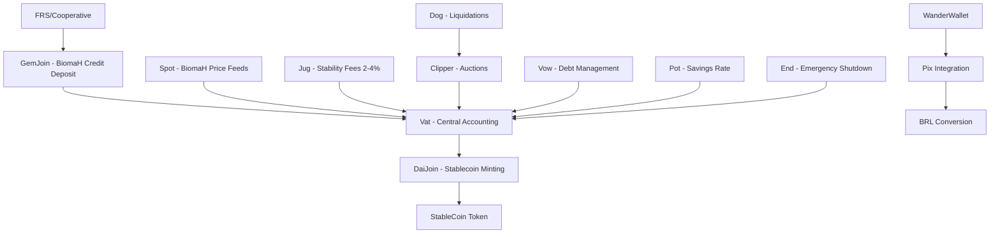

# Impact-Backed Stablecoin for Brazil's Solidarity Economy

Capitalizing BiomaH Credits to Unlock Billions in Environmental Finance

A transformative financial instrument—an impact-backed stablecoin fully collateralized by tokenized BiomaH credits—that bridges Brazil's thriving solidarity economy, maturing digital asset market, and untapped environmental assets. Built on the battle-tested MakerDAO/Sky Ecosystem architecture.

## 📁 Project Structure

This repository contains a full-stack DeFi application with smart contracts and a modern React frontend.

### Backend (Smart Contracts)
- **contracts/**: Solidity smart contracts implementing the stablecoin system
  - Core contracts: `Vat.sol`, `StableCoin.sol`, `Spot.sol`, `Dog.sol`, etc.
  - Token contracts: Environmental impact tokens (ECO, BIO, AMZN, etc.)
  - Utilities: `Multicall.sol`, `PriceFeed.sol`, `Faucet.sol`

### Frontend
- **frontendnew/**: Next.js React application with TypeScript
  - Modern UI with Tailwind CSS and Radix UI components
  - Web3 integration using Wagmi and RainbowKit
  - Internationalization support (English/Portuguese)
  - Pages: Vaults, Staking, Documentation

### Scripts & Tools
- **scripts/**: Deployment and configuration scripts for Sepolia testnet
- **tools/**: Development utilities (Doxygen for documentation)

## 🌟 What This Project Is About

### Executive Summary

Brazil stands at the intersection of three powerful forces: a thriving solidarity economy serving 30 million people, a rapidly maturing digital asset market with $318.8 billion in annual transaction volume 90% of which is in stablecoins, and billions in untapped environmental assets locked in conserved forests and regenerative biomes. This proposal presents a transformative financial instrument—an impact-backed stablecoin fully collateralized by tokenized BiomaH credits—that bridges these opportunities through decentralized finance infrastructure.

Through a 70% loan-to-value (LTV) structure backed by verified BiomaH credits representing conserved or regenerating Brazilian biomes, we unlock working capital while maintaining a 30% risk buffer against market volatility.

The opportunity is immediate and substantial: Brazil's regulatory environment has achieved unprecedented clarity through the Central Bank's BVAL framework; environmental assets are now explicitly eligible for tokenization under Law 15.042/2024. Existing infrastructure through EDinheiro, WanderWallet, and the Blockchain Brasil Network (RBB) provides turnkey integration pathways.

We are seeking $2-5 million in catalytic funding to launch pilot operations managing R$1-5 million in collateralized assets, with a clear path to $50+ million scale across 50+ FRS and cooperatives within 24 months.

### Market Opportunity & Context

#### Brazil's Solidarity Economy: Scale and Structure

Brazil's solidarity economy represents one of the world's most sophisticated alternative financial systems, built over three decades of grassroots organizing and government support.

**Quantified Scale:**
- 30,000+ active cooperatives involving approximately 3 million participants
- 22,000+ solidarity economy enterprises
- 30 million people served across the ecosystem
- 180+ community currencies actively circulating through the EDinheiro platform
- 200+ credit cooperatives providing financial services
- 270+ Solidarity Revolving Funds (FRS) using financial return mechanisms

**Main challenges:** 33% lack start-up capital, 29% lack adequate infrastructure, 36% face technical skills barriers

#### The Capital Scarcity Challenge

Despite managing substantial environmental and social assets, solidarity economy organizations face severe liquidity constraints:

**Current Barriers:**
- Limited collateral recognition: Traditional banks don't accept environmental stewardship as collateral
- High borrowing costs: When credit is available, interest rates are prohibitive for community organizations
- Asset-rich, cash-poor: Organizations stewarding millions of hectares of conserved forest lack working capital for payroll, investment, and operations
- Slow credit cycles: FRS typically provide R$5,000 loans with 6-month deferral and 6-month repayment at 2.5% interest—too slow and small for scaling

**Market Research Data:** The 2013 government survey identified lack of access to credit as the primary challenge for the majority of solidarity economy enterprises. Between 2009-2016, community banks grew from 51 to 118 specifically to address this credit gap.

#### Brazil's Digital Asset Market: Rapid Maturation

Brazil has emerged as Latin America's largest and most sophisticated digital asset market:

**Market Size:**
- $318.8 billion in digital asset transaction volume
- 90% of transactions use stablecoins
- 150+ million Brazilians use Pix instant payments daily
- 64 billion Pix transactions worth $4.6 trillion processed in 2024

**Regulatory Clarity:**
- BVAL (Law 14,478/22) established comprehensive framework for virtual asset service providers (VASPs) in June 2023
- Stablecoin regulation under development by Central Bank, expected implementation throughout 2025
- Tokenization framework explicitly covers environmental assets and carbon credits as of 2024
- Law 15.042/2024 instituted the Brazilian Emissions Trading System (SBCE), legitimizing carbon and environmental credit tokenization

**Infrastructure Maturity:**
- Blockchain Brasil Network (RBB) launched by Federal Court of Accounts (TCU) and National Development Bank (BNDES)
- EDinheiro platform managing 170+ social currencies with blockchain integration underway
- WanderWallet provides instant stablecoin-to-BRL conversion via Pix rails
- Aratu social currency pilot (July 2025) demonstrated first blockchain-native social currency in Indiaroba, Sergipe

#### Environmental Assets: The Untapped Collateral Base

Brazil's environmental assets represent massive unrealized economic value:

**Asset Inventory:**
- Amazon Rainforest: 60% of the 5.5 million km² total area is in Brazil
- Atlantic Forest: Only 12% remains of original coverage, yet represents critical biodiversity hotspot
- Cerrado Biome: 2 million km² of savanna ecosystems under pressure
- Current conservation: Millions of hectares under active stewardship by FRS members, indigenous communities, and family farmers

**Carbon Credit Market Context:**
- Brazil's voluntary carbon market generated approximately 525,000 credits from single 1,200-hectare Atlantic Forest restoration project (Mucununga)
- Projects typically generate 1 credit per ton of CO2 offset or sequestered
- High-integrity removal credits from reforestation command premium pricing

**BiomaH Credits Concept:** BiomaH credits represent a broader ecological value framework beyond carbon:
- Hectares of conserved or regenerating biome as the base unit
- Integration of biodiversity indicators, water cycle maintenance, and soil health
- Verification through digital MRV (monitoring, reporting, verification) systems using satellite imagery, IoT sensors, and field validation
- Tokenized representation on blockchain for transparent ownership and trading

## 🌟 Features

- **Impact-Backed Collateral**: BiomaH credits representing conserved/regenerating Brazilian biomes
- **Multi-Collateral Support**: Accept multiple environmental tokens as collateral (AMZN, BIO, REN, AGRI, AQUA, NIL, ECO)
- **Chainlink Price Feeds**: Real-time price data from Chainlink oracles
- **Over-Collateralization**: Maintains stability through 150% collateralization ratio (70% LTV)
- **Dutch Auction Liquidations**: Efficient price discovery for liquidated collateral
- **Savings Rate**: Earn yield on stablecoin holdings
- **Stability Fees**: Interest rates on borrowed stablecoins (2-4% annual)
- **Emergency Shutdown**: Global settlement mechanism for crisis situations
- **Batch Operations**: Multicall support for gas optimization
- **Brazil Integration**: Pix/WanderWallet off-ramps for BRL conversion
- **Solidarity Economy Focus**: Designed for FRS, cooperatives, and community organizations

## 🏗️ Architecture

### Solution Architecture

Our stablecoin employs a Collateralized Debt Position (CDP) model proven in DeFi protocols like MakerDAO:

#### How CDPs Work:
1. **Deposit**: FRS, cooperatives, or community organizations deposit tokenized BiomaH credits into a secure smart contract vault
2. **Valuation**: Oracle networks (potentially Chainlink) verify the current market value of deposited credits
3. **Minting**: Stablecoins are minted up to 70% of collateral value (150% collateralization ratio)
4. **Borrowing**: Organizations receive stablecoins for immediate liquidity needs
5. **Utilization**: Stablecoins converted to BRL via WanderWallet/Pix for payroll, investment, working capital
6. **Repayment**: Borrowers repay stablecoin debt plus stability fee to unlock collateral
7. **Liquidation Protection**: 30% buffer protects against collateral value decline; automatic liquidation only if ratio falls below 150%

#### Key Parameters:
- **Collateralization ratio**: 150% (70% LTV)
- **Stability fee**: 2-4% annual interest on borrowed amount
- **Liquidation penalty**: 10-13% if collateral value falls below threshold
- **Oracle refresh**: Real-time or daily price feeds depending on BiomaH credit market liquidity

### BiomaH Credit Valuation & Verification

Digital MRV Integration: BiomaH credits gain credibility and market value through robust monitoring systems:
- **Satellite monitoring**: Continuous coverage tracking forest cover, regeneration rates, and land use changes
- **IoT sensors**: Ground-level data collection for soil health, water quality, biodiversity indicators
- **AI analytics**: Machine learning models process imagery and sensor data to detect changes and verify conservation claims
- **Blockchain registry**: Immutable record of credit issuance, ownership transfers, and retirement
- **Third-party audits**: Periodic verification by accredited environmental auditors

**Valuation Methodology**: Multiple approaches can establish BiomaH credit market prices:
- **Carbon equivalency**: Base price on tons of CO2 offset or sequestration potential (current voluntary market: $5-20 per ton; high-integrity removal: $50-100+ per ton)
- **Ecological services valuation**: Price incorporates biodiversity, water cycle, soil health co-benefits
- **Hectare-based pricing**: Fixed BRL value per hectare of verified conserved/regenerating biome
- **Market discovery**: Allow secondary trading to establish equilibrium prices
- **Composite index**: Weighted formula combining multiple value dimensions

**Example Valuation**:
- 1,000 hectares Atlantic Forest conservation
- Estimated 400 tons CO2/hectare sequestration over 40 years
- Conservative $10/ton carbon price = $4 million total carbon value
- Discounted present value at 5%: ~$1.2 million
- Per-hectare value: $1,200 or approximately R$6,000
- At 70% LTV: R$4,200 immediate liquidity per hectare

### Stablecoin Design: USD-Pegged Stablecoin

Following dominant global models (USDT, USDC):
- **Immediate liquidity** on global DeFi protocols
- **Access** to deeper stablecoin liquidity pools
- **Simpler cross-border transactions**

**Structure**:
- 1 stablecoin = 1 USD peg
- BiomaH credits valued in USD terms
- Users bear FX conversion costs when converting to BRL via WanderWallet

### Smart Contract Architecture

**Core Contracts**:

- **Vault Contract**: Holds tokenized BiomaH credits as collateral, tracks individual CDP positions, enforces collateralization ratios, handles liquidations when thresholds breached
- **Stablecoin Contract**: ERC-20 token standard, minting/burning functions, transfer restrictions if regulatory compliance requires KYC/AML
- **Oracle Contract**: Receives BiomaH credit price feeds from trusted sources, aggregates multiple data sources for manipulation resistance, updates Vault Contract with current valuations, triggers liquidation checks when prices update
- **Liquidation Contract**: Automated auctions for liquidated collateral, incentive mechanisms for liquidator participation, penalty distribution to protocol treasury
- **Governance Contract (DAO)**: Parameter adjustments (collateralization ratios, stability fees, liquidation penalties), treasury management, protocol upgrade proposals, community voting mechanisms

**Security Measures**:
- Multi-signature admin controls for emergency shutdown
- Time-locks on parameter changes
- Third-party security audits (at least 2-3 firms)
- Bug bounty program
- Insurance fund from protocol fees to cover black swan events

### Integration Layer: WanderWallet and Pix

**WanderWallet Integration**:
- WanderWallet provides instant stablecoin-to-BRL conversion via Pix for travelers and locals
- Integration pathway: Stablecoin holders use WanderWallet to convert to BRL on-demand; scan Pix QR codes for payments; withdraw cash via Pix-Saque
- User experience: Solidarity economy members borrow stablecoin → open WanderWallet → convert to BRL → pay suppliers, workers, or vendors instantly
- Foreign currency bridge: WanderWallet also supports USD/EUR top-ups, enabling international solidarity economy funding flows

**Pix Rails**:
- Pix processes 64 billion transactions worth $4.6 trillion annually—the backbone of Brazilian digital payments
- Integration pathway: Through WanderWallet or direct integration with payment gateways that offer stablecoin → Pix conversion
- Speed: Instant settlement, 24/7/365 availability
- Reach: Accepted by virtually all Brazilian merchants and individuals

### Core Components



### Smart Contracts

| Contract | Purpose | Description |
|----------|---------|-------------|
| **Vat.sol** | Central Accounting | Core system state and CDP management |
| **StableCoin.sol** | ERC-20 Token | The stablecoin token with mint/burn |
| **Join.sol** | Token Adapters | Bridge between tokens and core system |
| **Spot.sol** | Price Management | Oracle price feeds and safety margins |
| **Dog.sol** | Liquidation Trigger | Monitors and triggers liquidations |
| **Clip.sol** | Auction System | Dutch auction liquidation mechanism |
| **Jug.sol** | Stability Fees | Interest rate accumulation |
| **Vow.sol** | System Finances | Debt/surplus management |
| **Pot.sol** | Savings Rate | Yield for stablecoin holders |
| **End.sol** | Emergency Shutdown | Global settlement mechanism |

## 🚀 Quick Start

### Prerequisites

- Node.js 18+
- npm or yarn
- Git

### Installation

```bash
# Clone the repository
git clone https://github.com/TerexitariusStomp/Mutiraon.git
cd mutiraon-stablecoin

# Install root dependencies
npm install

# Install frontend dependencies
cd frontendnew
npm install
cd ..
```

### Smart Contract Development

```bash
# Compile contracts
npm run compile

# Deploy to Sepolia testnet
npm run deploy:biome:sepolia

# Start local Hardhat network
npx hardhat node
```

### Frontend Development

```bash
# Start the frontend development server
npm run dev

# The app will be available at http://localhost:3000
```

### Environment Setup

```bash
# Copy environment template
cp .env.example .env

# Edit .env with your configuration:
# - PRIVATE_KEY: Your Ethereum private key
# - SEPOLIA_RPC_URL: Sepolia testnet RPC URL
# - ETHERSCAN_API_KEY: For contract verification
```

## 📖 Usage Guide

### For Solidarity Economy Organizations

The stablecoin system is designed specifically for FRS, cooperatives, and community organizations in Brazil's solidarity economy:

1. **Environmental Stewardship Verification**: Register conserved or regenerating biomes through our dMRV system
2. **BiomaH Credit Tokenization**: Convert verified environmental assets into tokenized BiomaH credits
3. **Open Vault**: Deposit BiomaH credits as collateral and mint stablecoins at 70% LTV
4. **Access Liquidity**: Convert stablecoins to BRL via WanderWallet/Pix for immediate working capital
5. **Repay & Maintain**: Service stability fees (2-4% annually) and maintain 150% collateralization ratio
6. **Scale Operations**: Use unlocked capital for payroll, investment, and sustainable growth

### Frontend Application

The React frontend provides a user-friendly interface for interacting with the stablecoin system:

1. **Connect Wallet**: Use MetaMask or other Web3 wallets
2. **Claim Test Tokens**: Use the faucet to get test BiomaH and environmental tokens
3. **Open Vault**: Create a CDP by depositing BiomaH credits and minting stablecoins
4. **Convert to BRL**: Use integrated WanderWallet/Pix off-ramp for instant BRL conversion
5. **Stake**: Earn yield by depositing stablecoins in the savings rate
6. **Monitor**: View system statistics, environmental impact metrics, and your positions

### Smart Contract Interaction

#### 1. Creating a Collateralized Debt Position (CDP) with BiomaH Credits

```javascript
// Example: Use 1000 BiomaH credits to mint 700 stablecoins (70% LTV)

// 1. Approve BiomaH transfer
await biomaHToken.approve(biomaHJoinAddress, parseEther("1000"));

// 2. Deposit BiomaH collateral
await biomaHJoin.join(userAddress, parseEther("1000"));

// 3. Create CDP and draw stablecoins
await vat.frob(
    formatBytes32String("BIOMAH-A"), // collateral type
    userAddress,                      // CDP owner
    userAddress,                      // collateral source
    userAddress,                      // stablecoin destination
    parseEther("1000"),              // collateral amount (BiomaH credits)
    parseEther("700")                // stablecoin amount (70% of $1000 value)
);

// 4. Exit stablecoins to wallet
await daiJoin.exit(userAddress, parseEther("700"));
```

#### 2. Converting Stablecoins to BRL via WanderWallet Integration

```javascript
// Convert stablecoins to BRL for solidarity economy payments
// This would integrate with WanderWallet's Pix conversion service
await wanderWallet.convertToBRL(
    stablecoinAmount,
    pixRecipientAddress,  // Supplier, worker, or vendor Pix address
    paymentDescription    // "Payroll" or "Working capital"
);
```

#### 2. Using Multicall for Batch Operations

```javascript
// Create a CDP in a single transaction
const calls = await multicall.createCDPBatch(
    userAddress,
    vatAddress,
    ecoJoinAddress,
    daiJoinAddress,
    formatBytes32String("ECO-A"),
    parseEther("1000"), // ECO amount
    parseEther("50")    // Stablecoin amount
);

await multicall.aggregate(calls);
```

#### 3. Earning with Savings Rate

```javascript
// Join the savings pot to earn yield
await pot.drip(); // Update savings rate
await pot.join(parseEther("100")); // Deposit 100 Mutiraon

// Later, exit with accumulated interest
await pot.exit(parseEther("100"));
```

#### 4. Liquidation Process

```javascript
// Liquidate an unsafe position
await dog.bark(
    formatBytes32String("ECO-A"), // collateral type
    unsafeUserAddress,              // CDP to liquidate
    keeperAddress                   // liquidation incentive recipient
);

// Participate in auction
await clipper.take(
    auctionId,
    parseEther("100"),  // max collateral to buy
    maxPriceRay,        // max acceptable price
    buyerAddress,       // collateral recipient
    "0x"               // no callback data
);
```

## 📋 Go-to-Market Strategy

### Pilot Phase: Aratu Model Replication

The July 2025 launch of the Aratu blockchain-based social currency in Indiaroba, Sergipe provides a proven template:

**Aratu Pilot Characteristics**:
- Community: ~18,000 residents, primarily marisqueiras (women shellfish harvesters)
- Technology: Built on Rede Blockchain Brasil (RBB), integrated with Chainlink oracles and EDinheiro platform
- Governance: Community-led with transparent blockchain audit trails
- Compliance: LGPD-compliant data handling

**Our Pilot Strategy**:

**Target Communities**:
- Amazon biome: FRS supporting family farmers and extractivists in Pará, Amazonas, or Acre
- Cerrado biome: Pequi production cooperatives in northern Minas Gerais (established FRS model)
- Atlantic Forest biome: Restoration communities in Bahia or São Paulo

**Selection Criteria**:
- Existing FRS or cooperative with proven governance
- Demonstrable environmental stewardship (conserved or regenerating biomes)
- Partnership with EDinheiro or similar solidarity finance platform
- Community leadership committed to blockchain transparency
- 500-5,000 direct participants for manageable pilot scale

**Pilot Deliverables**:
- BiomaH credit tokenization: Map, verify, and tokenize 5,000-20,000 hectares per pilot site
- CDP deployment: Launch 3-5 CDP vaults serving 10-20 organizations per site
- Stablecoin issuance: R$500,000 - R$2 million in initial stablecoin loans
- Impact tracking: 6-month monitoring of liquidity improvements, credit access, and environmental outcomes
- Community education: Training modules on wallet usage, CDP mechanics, and risk management

### Ecosystem Partnerships

**Strategic Partners**:

- **Plexos Institute**: Science and technology institute focused on democratizing access to emerging technologies. Lead architect of Aratu pilot; RBB validator and associate member. Role: Institutional coordination, regulatory navigation, technology integration

- **EDinheiro**: Platform managing 170+ social currencies with 30+ years collective experience. Great way to connect with credit cooperatives and funds. Role: Community currency integration, governance frameworks, user training

- **Carbon Credit Cooperative of Brazil (CBCC)**: Cooperative structure aggregating carbon credit supply. Role: BiomaH credit aggregation, quality verification, market-making

- **Chainlink**: Oracle infrastructure provider; proven partner in Aratu pilot. Role: Price feed oracles for BiomaH credits, cross-chain connectivity via Chainlink Runtime Environment

- **WanderWallet**: Stablecoin-to-BRL conversion via Pix. Role: Off-ramp infrastructure for converting stablecoins to spendable BRL

- **Biomas**: Major reforestation company backed by Vale, Marfrig, Suzano, Santander, Itaú, Rabobank. Focus on high-integrity projects from Atlantic Forest and Amazon restoration. Role: Potential BiomaH credit supply partner; reforestation project integration

### Regulatory Engagement

- **Central Bank of Brazil (BCB)**: Advisory consultations on VASP licensing requirements. Compliance alignment with emerging stablecoin regulations (expected 2025). Pilot sandboxes: Leverage BCB's openness to innovation in regulated environments

- **Securities and Exchange Commission (CVM)**: Tokenization framework consultation (public consultation expected by end of 2025). Classification of BiomaH credits: Securities vs. commodities vs. payment instruments

- **Ministry of Environment and Climate Change**: Alignment with SBCE (regulated carbon market) implementation. Recognition of BiomaH credits as complementary to carbon credits under Law 15.042/2024

- **National Secretariat of Solidarity Economy**: Policy support for solidarity finance innovation. Integration with government mapping of solidarity economy enterprises

## 📊 Impact Framework

### Environmental Impact Metrics
- **Hectares protected**: Total biome area under conservation backed by collateralized BiomaH credits
- **Tons of CO2 offset/sequestered**: Carbon equivalency of protected forests and regeneration projects
- **Biodiversity indicators**: Species richness, habitat connectivity, threatened species populations in protected areas
- **Restoration area monitored**: Hectares of degraded land undergoing active regeneration
- **Ecological Benefits Framework**: Composite scoring integrating multiple ecosystem services

### Social Impact Metrics
- **Smallholders and communities financed**: Number of individuals and families accessing credit
- **Payroll dispersed**: Total wages paid to community members using stablecoin liquidity
- **New local ventures capitalized**: Number of solidarity economy enterprises launched or expanded
- **Women's economic participation**: Percentage of credit recipients and governance participants who are women (solidarity economy typically 37% women)
- **Indigenous and traditional community inclusion**: Participation of quilombolas, indigenous peoples, and traditional extractivists

### Financial Impact Metrics
- **Total BiomaH credits secured as collateral**: Volume and value in both hectares and BRL/USD
- **Stablecoin volume issued and circulated**: Total outstanding debt positions
- **Capital multiplier effect**: Ratio of economic activity enabled per R$1 of stablecoin issued
- **Interest savings**: Comparison of stability fees vs. traditional credit costs
- **Default rates**: Percentage of CDPs requiring liquidation
- **Collateral appreciation**: Increase in BiomaH credit values over time

## 💰 Financial Model

### Revenue Streams
1. **Origination Fees (1-2%)**: One-time fee charged when opening a CDP and minting stablecoins
2. **Stability Fees (2-4% annual interest)**: Ongoing interest on outstanding stablecoin debt
3. **Stablecoin-to-Fiat Conversion Fees (0.5-1%)**: Small fee on WanderWallet or other off-ramp conversions to BRL
4. **Liquidation Penalties (10-13%)**: Applied to liquidated collateral to cover protocol costs and create liquidator incentives
5. **Appreciation of BiomaH Credit Value**: If BiomaH credits appreciate, protocol captures value through collateral held during liquidations or treasury holdings
6. **Treasury Management**: Protocol treasury deployed in yield-generating DeFi protocols or Brazilian government bonds

### Cost Structure
1. **Oracle Fees**: Chainlink or alternative oracle network fees for price feeds
2. **Legal and Compliance**: VASP licensing, ongoing regulatory reporting, legal counsel
3. **Smart Contract Audits**: 2-3 security audits pre-launch, annual re-audits
4. **BiomaH Credit Verification and dMRV**: Satellite data, IoT sensors, third-party auditors, AI/ML development
5. **Technology Infrastructure**: Cloud hosting, databases, node operation
6. **Team Salaries**: Pilot phase 8-12 full-time team members
7. **Marketing and Community Education**: Educational materials, workshops, events
8. **Insurance and Risk Management**: Smart contract insurance, treasury insurance, liquidation buffer fund

**Total Estimated Costs**: Pilot phase (Year 1): $1.2-2.0 million; Scale phase (Year 2+): $1.0-1.5 million annually

### Sustainability Path
- **Phase 1: Pilot (Months 1-12)**: Target AUM R$1-5 million, stablecoin issuance R$700,000-3.5 million, revenue R$175,000-450,000, funding requirement $2-5 million
- **Phase 2: Growth (Months 13-24)**: Target AUM R$50-200 million, stablecoin issuance R$35-140 million, revenue R$1.75-7 million annually, break-even ~R$50-75 million AUM
- **Phase 3: Scale (Year 3+)**: Target AUM R$500 million-2 billion, stablecoin issuance R$350 million-1.4 billion, revenue R$8.75-35 million annually, net margin 40-50%

### Capital Requirements and Use of Funds
**Seed Round: $2-5 Million**

**Use of Funds Breakdown**:
- **Technology Development (30%)**: Smart contract development, audits, BiomaH tokenization, dMRV systems
- **Pilot Operations (25%)**: 3 pilot site implementations, community education, initial liquidity provision
- **Legal and Regulatory (20%)**: VASP licensing, compliance infrastructure
- **Team (15%)**: Core team salaries for 12 months
- **Partnerships and Marketing (10%)**: Strategic alliances, community outreach

## ⚙️ System Parameters

### Collateral Types

| Parameter | BiomaH-A | ECO-A | BIO-A | Description |
|-----------|----------|-------|-------|-------------|
| **Token Address** | `<address>` | `<address>` | `<address>` | Token contracts |
| **Oracle Feed** | `<address>` | `<address>` | `<address>` | Price feed addresses |
| **Liquidation Ratio** | 150% | 150% | 150% | Minimum collateralization (70% LTV) |
| **Stability Fee** | 2-4% APR | 2% APR | 2% APR | Interest on borrowed stablecoins |
| **Liquidation Penalty** | 10-13% | 10% | 10% | Fee on liquidated positions |
| **Debt Ceiling** | 10M | 10M | 10M | Maximum debt per collateral type |
| **Dust Limit** | 100 | 100 | 100 | Minimum debt per position |

### Global Parameters

- **Network**: Ethereum Sepolia (testnet), Ethereum Mainnet (production)
- **Total Debt Ceiling**: 50M stablecoins
- **Savings Rate**: 0% (configurable)
- **Emergency Shutdown Delay**: 24 hours
- **Target Communities**: FRS, cooperatives, solidarity economy organizations
- **Off-ramp Integration**: WanderWallet + Pix for BRL conversion

## 🛡️ Security Features

### Risk Management

1. **Over-Collateralization**: All positions must maintain 150% collateral ratio
2. **Liquidation System**: Automatic liquidation of unsafe positions
3. **Price Oracle Protection**: Multiple price feed sources with staleness checks
4. **Emergency Shutdown**: Global settlement mechanism for extreme scenarios

### Access Control

- **Administrative Functions**: Protected by `auth` modifier
- **Permission System**: Granular control over contract interactions
- **Upgradeable Components**: Individual contracts can be replaced via governance

## 🔧 Configuration

### Price Feeds

```javascript
// Update ECO price feed
await spot.file(
    formatBytes32String("ECO-A"),
    formatBytes32String("pip"),
    newPriceFeedAddress
);

// Update liquidation ratio
await spot.file(
    formatBytes32String("ECO-A"),
    formatBytes32String("mat"),
    newLiquidationRatio
);
```

### System Parameters

```javascript
// Update stability fee (5% APR example)
const fivePercentAPR = "1000000001547125957863212448";
await jug.file(
    formatBytes32String("ECO-A"),
    formatBytes32String("duty"),
    fivePercentAPR
);

// Update debt ceiling
await vat.file(
    formatBytes32String("ECO-A"),
    formatBytes32String("line"),
    newDebtCeiling
);
```

## 📊 Monitoring & Analytics

### Key Metrics to Track

1. **System Health**
    - Total stablecoin debt outstanding
    - Collateralization ratio (target: 150%+)
    - Surplus/deficit in system treasury

2. **Environmental Impact Metrics**
    - Total BiomaH credits collateralized (hectares)
    - CO2 offset/sequestered (tons)
    - Biodiversity indicators tracked
    - Restoration area under monitoring

3. **Social Impact Metrics**
    - Number of solidarity economy organizations financed
    - Total payroll dispersed via stablecoin liquidity
    - New ventures capitalized
    - Women's economic participation rate

4. **Per-Collateral Metrics**
    - Debt utilization vs ceiling
    - Average collateralization ratio
    - Liquidation volume and frequency

5. **Economic Indicators**
    - Stability fee collection (2-4% APR)
    - Savings rate distribution
    - Auction participation in liquidations
    - WanderWallet/Pix conversion volumes

6. **Brazil Integration**
    - Chainlink price feed updates for BiomaH credits
    - Pix transaction volumes and success rates
    - Gas costs and optimization on Ethereum
    - Regulatory compliance monitoring

### Query Examples

```javascript
// Get system debt
const totalDebt = await vat.debt();

// Get BiomaH collateral info
const biomaHIlk = await vat.ilks(formatBytes32String("BIOMAH-A"));
console.log("BiomaH debt:", biomaHIlk.Art);
console.log("BiomaH rate:", biomaHIlk.rate);

// Get user position
const userVault = await vat.urns(formatBytes32String("BIOMAH-A"), userAddress);
console.log("BiomaH Collateral:", userVault.ink);
console.log("Debt:", userVault.art);

// Get environmental impact metrics
const totalBiomaHCollateralized = await biomaHRegistry.totalCollateralized();
console.log("Total hectares collateralized:", totalBiomaHCollateralized);
```

## 🚨 Emergency Procedures

### Emergency Shutdown

```javascript
// Trigger emergency shutdown (admin only)
await end.cage();

// Process individual collateral types
await end.cage(formatBytes32String("ECO-A"));
await end.cage(formatBytes32String("BIO-A"));

// Users can then redeem OGUSD for proportional collateral
await end.pack(ogusdAmount); // Convert OGUSD to claims
await end.cash(formatBytes32String("ECO-A"), claimAmount); // Redeem for ECO
```

## 🧪 Testing

### Run Test Suite

```bash
npm test
```

### Test Coverage

- **Unit Tests**: Individual contract functionality
- **Integration Tests**: Cross-contract interactions
- **Scenario Tests**: Complex user workflows
- **Edge Case Tests**: Liquidations, emergency shutdown

## 📝 Development

### Adding New Collateral Types

1. Deploy new `GemJoin` contract for the token
2. Initialize collateral type in `Vat`
3. Configure price feed in `Spot`
4. Set up liquidation in `Dog` and `Clipper`
5. Configure system parameters

### Upgrading Components

The system is designed for modularity. Individual components can be upgraded:

1. Deploy new contract version
2. Configure new contract
3. Update permissions (`rely`/`deny`)
4. Migrate state if necessary

## 🤝 Contributing

We welcome contributions from developers, environmental scientists, solidarity economy practitioners, and blockchain experts. Areas of particular interest:

1. **Environmental Science**: dMRV system development, satellite imagery analysis, IoT sensor integration
2. **Brazil Expertise**: Solidarity economy partnerships, regulatory navigation, community engagement
3. **DeFi Development**: Smart contract optimization, oracle integration, frontend enhancements
4. **Impact Measurement**: Environmental and social impact tracking systems

### Contribution Process

1. Fork the repository
2. Create a feature branch (`git checkout -b feature/amazing-feature`)
3. Add tests for new functionality
4. Ensure all tests pass
5. Submit a pull request with detailed description

## 📄 License

This project is licensed under the MIT License - see the [LICENSE](LICENSE) file for details.

## ⚠️ Disclaimer

This is experimental software for Brazil's solidarity economy and environmental finance. Use at your own risk. Always conduct thorough testing before deploying to mainnet. This system involves real environmental assets and financial instruments—consult with legal and financial professionals before participation.

---

## 🏆 Acknowledgments

Built on the foundation of the MakerDAO/Sky Ecosystem, one of the most battle-tested stablecoin architectures in DeFi. Special thanks to:

- **MakerDAO Community**: For creating such a robust and well-documented system
- **Brazil's Solidarity Economy Movement**: 30+ years of grassroots financial innovation
- **Plexos Institute & Aratu Pilot**: Pioneering blockchain-native social currencies
- **Chainlink, WanderWallet, EDinheiro**: Critical infrastructure partners
- **Environmental Communities**: Indigenous peoples, family farmers, and cooperatives stewarding Brazil's biomes

## 🌱 Conclusion: Regenerating Finance to Regenerate Nature

Brazil's solidarity economy demonstrates that economic cooperation, democratic governance, and environmental stewardship can coexist at scale. The country's 30 million participants in cooperatives and community currencies prove the model's viability. Yet these organizations remain financially marginalized, unable to access capital despite stewarding immense ecological wealth.

Blockchain technology and decentralized finance offer a breakthrough: the ability to tokenize environmental assets, create transparent collateral registries, and automate lending without traditional intermediaries. Brazil's regulatory clarity, advanced digital payment infrastructure (Pix), and pioneering blockchain initiatives (RBB, Aratu) provide an ideal environment for deployment.

Our impact-backed stablecoin is not just a financial instrument—it is a new economic paradigm. By collateralizing BiomaH credits representing conserved and regenerating biomes, we transform ecological stewardship from a cost into a source of capital. Communities protecting forests can pay their members, invest in sustainable production, and grow their enterprises without selling their environmental assets or turning to extractive industries.

This is Regenerative Finance (ReFi) in action: financial systems that don't just sustain but actively restore ecological and social systems. We mobilize billions in environmental value to empower millions of people, protect millions of hectares, and prove that economic development and environmental regeneration are not opposites but partners.

The opportunity is now. Brazil's regulations are aligning. The technology is proven. The communities are organized and ready. The environmental urgency is undeniable. With catalytic capital, we can launch the pilots that demonstrate viability, build the infrastructure that enables scale, and catalyze the partnerships that unlock billions in environmental finance for Brazil's solidarity economy—and ultimately, the world.

**Join us in building the future where protecting nature creates prosperity.**
